# School District Analysis

## Overview

### Background
Maria is Chief Data Scientist for a city school district who is tasked with preparing all standardized test data for analysis and reporting to provide insights and performance. I helped Maria analyze data for student funding and students' standardized test scores. This analysis will help School Board in making decisions regarding school budget and priorities.

### Purpose
Maria was informed that data shows evidence of academic dishonesty. Specifically, reading and math grades for Thomas High School 9th graders appear to have been altered. We are replacing math and reading scores for Thomas High School with NaNs while keeping the rest of the data intact. After that we will do the school district analysis again and write a report that describes how these changes affected the analysis. 

### Resources
* Data Source: schools_complete.csv, students_complete.csv
* Software: Jupyter Notebook 6.1.6, Visual Studio Code 1.52.1

## Results

* **How is the district summary affected?**

Previous District Summary:

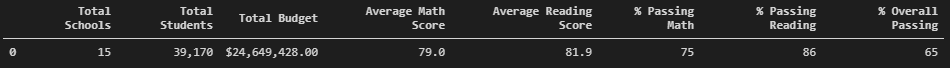

Updated District Summary:

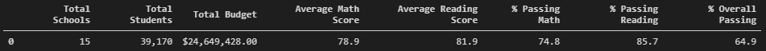

Following changes occured in District Summary:

    1. Average Math Score reduced from 79.0 to 78.9
    2. % Passing Math reduced from 75.0 to 74.8
    3. % Passing Reading reduced from 86.0 to 85.7
    4. % Overall Pass reduced from 65.0 to 64.9
    

* **How is the school summary affected?**

Previous School Summary:

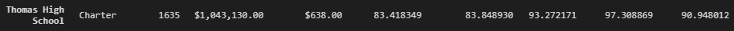

Updated School Summary:

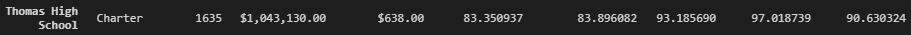

Following changes occured for Thomas High School (THS):

    1. Average Math Score for THS reduced from 83.418349 to 83.350937
    2. Average Reading Score for THS increased from 83.848930 to 83.896082
    3. % Passing Math reduced from 93.272171 to 93.185690
    4. % Passing Reading reduced from 97.388869 to 97.018739
    5. % Overall Pass reduced from 90.948012 to 90.630324
* **How does replacing the ninth graders’ math and reading scores affect Thomas High School’s performance relative to the other schools?**

Previous Thomas High School Rank : 2nd

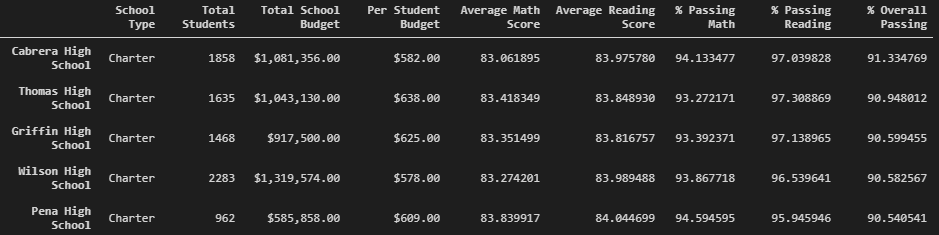

Updated Thomas High School Rank : 2nd

*There is no change in Thomas High School's performance relative to other schools.*

* **How does replacing the ninth-grade scores affect the following:**
    
    * **Math and Reading scores by grade**

    1. The Math and Reading Scores for Thomas High School's 9th grade is replaced by "nan". There are no changes for 10th-12th grades.
    2. The scores for all other schools remain unchanged  
    

        Math Scores by Grade:

        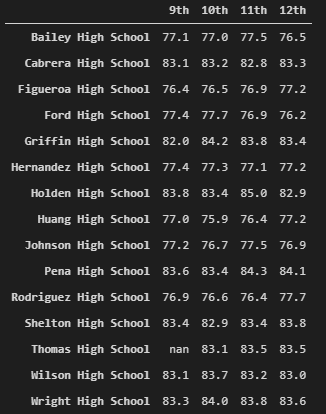

        Reading Scores by Grade:

        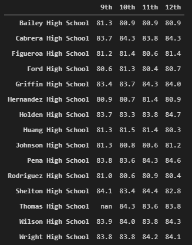

    * **Scores by school spending**
        
        *There seems to be no changes in scores by school spending after formatting.*

        Previous Scores by School Spending:

        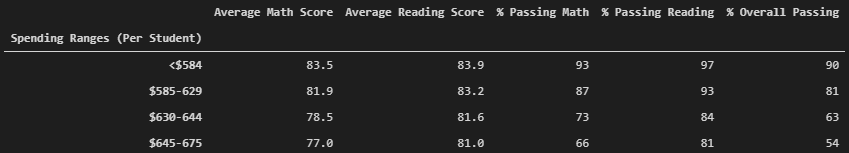

        Updated Scores by School Spending:

        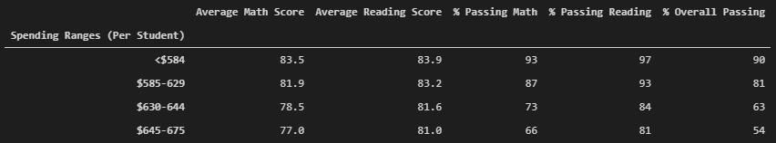
    

    * **Scores by school size**

        *There is no change in scores by school size if we consider formatted data.*

        Previous Scores by School Size:

        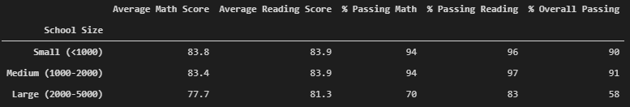

        Updated Scores by School Size:

        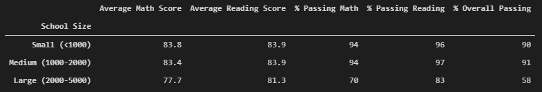   

    * **Scores by school type**

        *There are not changes in scores by school type*

        Previous Scores by School Type:

        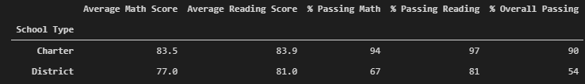

        Updated Scores by School Type:

        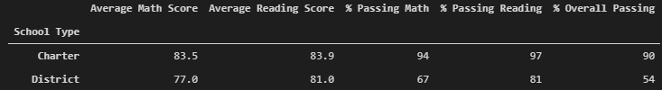  

## Summary

After replacing scores for 9th grade for Thomas High School with NaN, follwing major changes occured.

1. In School Summary, **% Overall Passing** for Thomas High School reduced by 0.317688. I.e., from 90.948012 to 90.630324.
2. In School Summary, **% Passing Reading** for  Thomas High School reduced by 0.37013. I.e., from 97.388869 to 97.018739.
3. **Average Reading Score** for Thomas High School increased by 0.047152in School Summary. I.e., from 83.848930 to 83.896082.
4. **% Passing Reading** in District Summary decreased by 0.3. I.e., from 86 to 85.7. 