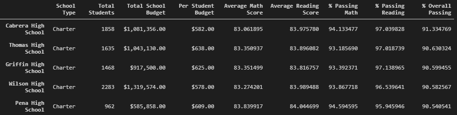

# School District Analysis

## Overview

## Results:

* **How is the district summary affected?**

Previous District Summary:

Updated District Summary:

Following changes occured in District Summary

    1. **Average Math Score** reduced from 79.0 to 78.9
    2. **% Passing Math** reduced from 75.0 to 74.8
    3. **% Passing Reading** reduced from 86 to 85.7
    4. **% Overall Pass** reduced from 65 to 64.9
    

* **How is the school summary affected?**

Previous School Summary:

Updated School Summary:

Following changes occured for Thomas High School (THS)

    1. **Average Math Score** for THS reduced from 83.418349 to 83.530937
    2. **Average Reading Score** for THS reduced from 83.848930 to 83.896082
    2. **% Passing Math** reduced from 93.272171 to 93.185690
    3. **% Passing Reading** reduced from 97.388869 to 97.018739
    4. **% Overall Pass** reduced from 90.948012 to 90.630324
* **How does replacing the ninth graders’ math and reading scores affect Thomas High School’s performance relative to the other schools?**

Previous Thomas High School Rank: 2nd

Updated Thomas High School Rank: 2nd

*There is no change in Thomas High School's performance relative to other schools.*

* **How does replacing the ninth-grade scores affect the following:**
    
    * **Math and Reading scores by grade**

    1. The Math and Reading Scores for Thomas High School's 9th grade is replaced by "nan". There are no changes for 10th-12th grades.
    2. The scores for all other schools remain unchanged  
    

    Math Scores by Grade:

    

    Reading Scores by Grade:

    

    * **Scores by school spending**
        
        *There is no change in scores by school spending.*

        Previous Scores by School Spending:

        

        Updated Scores by School Spending:

        
    

    * **Scores by school size**

        *There is no change in scores by school size.*

        Scores by School Size:

        

        Updated Scores by School Spending:

           

    * **Scores by school type**

        *There are not changes in scores by school type*

        Scores by School Type:

        

        Updated Scores by School Type:

          

## Summary
